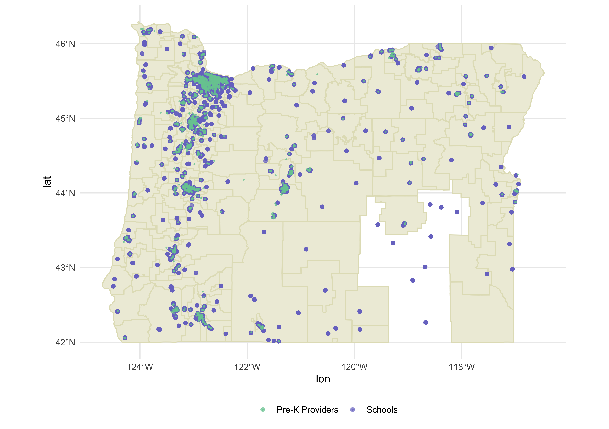

# Early Childhood Care and Kindergarten Readiness
This project investigates differences in registered pre-K providers (in terms of state-assigned quality ratings) and children's scores on the Oregon Kindergarten Assessment. Importantly, data are not linked at the individual student level. Rather, this project investigates whether the geographic proximity of pre-K providers to schools relates to kindergarten readiness. 

A preliminary view of why this is an issue is shown in the map below. As can be seen, there are numerous schools (shown by purple points) where there are no registered pre-K providers (small green points) in the immediate area.

